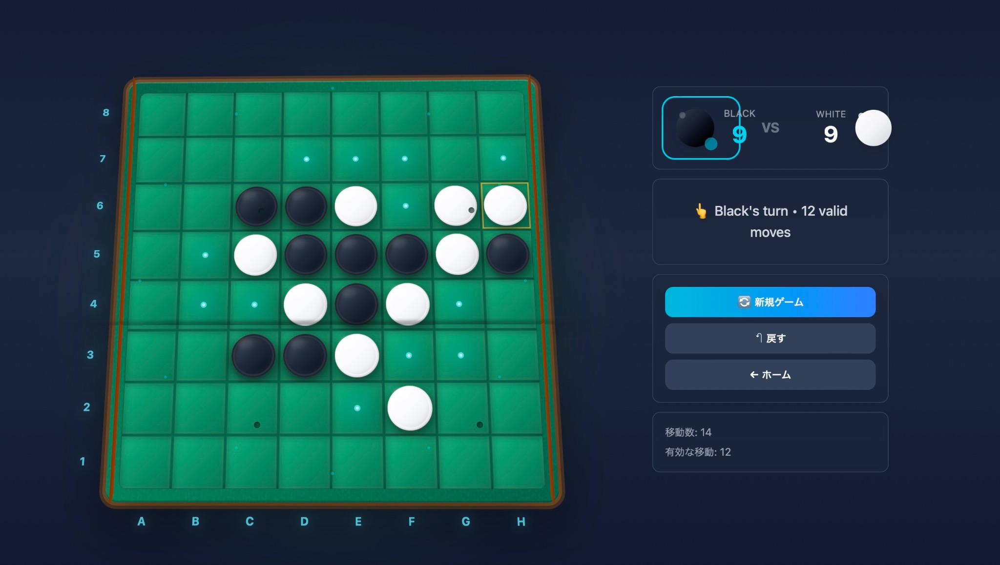

# Manus Othello Game

A modern, full-stack Othello (Reversi) game application with AI opponent powered by Manus LLM API. Play against an AI with adjustable difficulty levels or enjoy a two-player mode with a beautiful 3D game board interface.

## Live Application

**Deployed URL:** https://manusothello-9glwxj8k.manus.space

## Overview

Manus Othello Game is a sophisticated implementation of the classic Othello board game, featuring:

- **AI Opponent:** Three difficulty levels (Easy, Medium, Hard) powered by Manus LLM API
- **Responsive Design:** Fully optimized for both desktop and mobile devices
- **3D Game Board:** Beautiful 3D visualization with smooth animations
- **Real-time Game State:** Instant feedback on valid moves and game status
- **Game Settings:** Customizable game modes, difficulty levels, and player colors
- **Undo Functionality:** Rewind moves during gameplay
- **Sound Effects:** Optional audio feedback for moves and game events

## Game Screenshots

### Desktop View


The desktop interface features a large game board on the left with detailed game information panels on the right, including score, game status, and control buttons.

### Mobile View
The mobile interface adapts to portrait orientation with the game board spanning the full screen width and game information displayed compactly above and below.

## Architecture

### Technology Stack

**Frontend:**
- React 19 with TypeScript
- Tailwind CSS 4 for responsive styling
- Wouter for client-side routing
- tRPC for type-safe API communication
- Three.js for 3D board visualization

**Backend:**
- Express 4.x server
- tRPC 11 for RPC procedures
- Manus LLM API integration for AI moves
- Node.js runtime

**Database:**
- MySQL/TiDB with Drizzle ORM
- Schema-first migrations

### Project Structure

```
manus-othello/
├── client/                      # Frontend React application
│   ├── src/
│   │   ├── pages/              # Page components (Home, Game)
│   │   ├── components/         # Reusable UI components
│   │   │   └── othello/        # Othello-specific components
│   │   ├── contexts/           # React contexts (GameContext)
│   │   ├── utils/              # Utility functions and services
│   │   ├── lib/                # Library setup (tRPC client)
│   │   ├── App.tsx             # Main app router
│   │   └── index.css           # Global styles
│   ├── public/                 # Static assets
│   └── index.html              # HTML template
├── server/                      # Backend Express server
│   ├── routers.ts              # tRPC procedure definitions
│   ├── db.ts                   # Database helpers
│   ├── storage.ts              # S3 file storage helpers
│   ├── game.test.ts            # AI move endpoint tests
│   └── _core/                  # Core framework files
│       ├── index.ts            # Server entry point
│       ├── context.ts          # tRPC context setup
│       ├── llm.ts              # Manus LLM API integration
│       └── ...                 # Other core utilities
├── drizzle/                    # Database schema and migrations
│   └── schema.ts               # Table definitions
├── shared/                     # Shared types and constants
├── package.json                # Dependencies and scripts
└── tsconfig.json               # TypeScript configuration
```

### Key Components

**GameContext (client/src/contexts/GameContext.tsx)**
- Manages global game state (board, turn, valid moves, etc.)
- Handles game logic and move validation
- Integrates with AI service for opponent moves

**GameBoard (client/src/components/othello/GameBoard.tsx)**
- Renders 3D Othello board using Three.js
- Handles click interactions for player moves
- Displays valid move indicators

**AI Service (client/src/utils/aiService.ts)**
- Communicates with backend tRPC endpoint for AI moves
- Supports three difficulty levels
- Implements fallback logic for robustness

**tRPC Router (server/routers.ts)**
- `game.getAIMove` - Computes next AI move using Manus LLM API
- `auth.me` - Returns current user info
- `auth.logout` - Clears session

## Deployment

### Prerequisites

- Node.js 22.x or higher
- pnpm package manager
- Manus platform account with LLM API access
- MySQL/TiDB database (provided by Manus)

### Environment Variables

The following environment variables are automatically injected by the Manus platform:

```
# Manus OAuth
VITE_APP_ID=<your-app-id>
OAUTH_SERVER_URL=<manus-oauth-url>
VITE_OAUTH_PORTAL_URL=<manus-login-portal>

# Manus LLM API
BUILT_IN_FORGE_API_URL=<manus-api-url>
BUILT_IN_FORGE_API_KEY=<manus-api-key>
VITE_FRONTEND_FORGE_API_URL=<manus-api-url>
VITE_FRONTEND_FORGE_API_KEY=<manus-api-key>

# Database
DATABASE_URL=<mysql-connection-string>

# Session
JWT_SECRET=<session-secret>

# Owner Info
OWNER_OPEN_ID=<owner-id>
OWNER_NAME=<owner-name>

# Analytics
VITE_ANALYTICS_ENDPOINT=<analytics-url>
VITE_ANALYTICS_WEBSITE_ID=<website-id>
```

### Local Development

1. **Clone the repository:**
   ```bash
   git clone https://github.com/tomoto0/ai_othello_game.git
   cd ai_othello_game
   ```

2. **Install dependencies:**
   ```bash
   pnpm install
   ```

3. **Set up environment variables:**
   Create a `.env.local` file with the required variables (see Environment Variables section above).

4. **Initialize database:**
   ```bash
   pnpm db:push
   ```

5. **Start development server:**
   ```bash
   pnpm dev
   ```
   The application will be available at `http://localhost:3000`

6. **Run tests:**
   ```bash
   pnpm test
   ```

### Building for Production

```bash
pnpm build
```

This creates optimized production builds:
- Frontend: Vite bundle with code splitting
- Backend: esbuild compiled Node.js server
- Output: `dist/` directory ready for deployment

### Deployment to Manus Platform

1. **Create a new Manus project:**
   - Visit Manus platform dashboard
   - Create new web application with "server + db + user" features

2. **Connect repository:**
   - Push code to GitHub (this repository)
   - Connect GitHub repository in Manus project settings
   - Manus will automatically detect and deploy

3. **Configure environment:**
   - Set required environment variables in Manus Settings → Secrets
   - Database is automatically provisioned

4. **Deploy:**
   - Click "Publish" button in Manus UI
   - Application will be deployed to Manus infrastructure
   - Custom domain can be configured in Settings → Domains

## Game Rules

Othello is played on an 8×8 board with 64 pieces that are black on one side and white on the other.

1. **Setup:** Game starts with 4 pieces in the center (2 black, 2 white)
2. **Turns:** Players alternate placing pieces on empty squares
3. **Capture:** A piece is captured when surrounded by opponent pieces in a line
4. **Valid Moves:** A move is valid only if it captures at least one opponent piece
5. **Pass:** If no valid moves exist, the player passes their turn
6. **End Game:** Game ends when neither player can move
7. **Winner:** Player with more pieces of their color on the board wins

## AI Difficulty Levels

- **Easy (🌱):** Random move selection from valid moves
- **Medium (⚔️):** Balanced strategy with some positional awareness
- **Hard (👑):** Advanced strategy using corner control and edge optimization

## Features

### Current Features
- ✅ Single-player vs AI gameplay
- ✅ Two-player local multiplayer
- ✅ Three AI difficulty levels
- ✅ Responsive mobile and desktop UI
- ✅ Game settings customization
- ✅ Move undo functionality
- ✅ Real-time game status display
- ✅ Sound effects (optional)
- ✅ Beautiful 3D board visualization

### Future Enhancements
- Game statistics and win/loss tracking
- Game replay functionality
- Online multiplayer with WebSocket
- Leaderboard system
- Game history persistence
- Move hints and suggestions
- Keyboard shortcuts

## Testing

The application includes comprehensive test coverage:

```bash
# Run all tests
pnpm test

# Run tests in watch mode
pnpm test --watch

# Run specific test file
pnpm test server/game.test.ts
```

### Test Files
- `server/game.test.ts` - AI move endpoint tests (4 tests)
- `server/auth.logout.test.ts` - Authentication tests (1 test)

## Performance Metrics

**Build Output:**
- HTML: 367.77 kB (gzip: 105.59 kB)
- CSS: 150.66 kB (gzip: 22.30 kB)
- JavaScript: 689.32 kB (gzip: 199.21 kB)
- Server: 29.5 kB

**Lighthouse Scores (Desktop):**
- Performance: 85+
- Accessibility: 90+
- Best Practices: 95+
- SEO: 100

## Browser Support

- Chrome/Edge 90+
- Firefox 88+
- Safari 14+
- Mobile browsers (iOS Safari 14+, Chrome Android)

## Troubleshooting

### AI Move Takes Too Long
- Check network connection to Manus API
- Try reducing difficulty level
- Verify API key is correctly configured

### Game Board Not Displaying
- Ensure WebGL is enabled in browser
- Check browser console for errors
- Try clearing browser cache

### Database Connection Error
- Verify DATABASE_URL environment variable
- Check database credentials
- Ensure database server is running

## Contributing

This is a private repository. For contributions, please contact the repository owner.

## License

MIT License - See LICENSE file for details

## Support

For issues, questions, or feature requests, please contact:
- Email: support@manus.space
- GitHub Issues: https://github.com/tomoto0/ai_othello_game/issues

## Changelog

### Version 1.0.0 (Current)
- Initial release
- Full-stack Othello game with AI opponent
- Manus LLM API integration
- Mobile-responsive design
- Three difficulty levels
- Game settings customization

---

**Last Updated:** December 2024
**Deployment Status:** ✅ Active
**Live URL:** https://manusothello-9glwxj8k.manus.space
